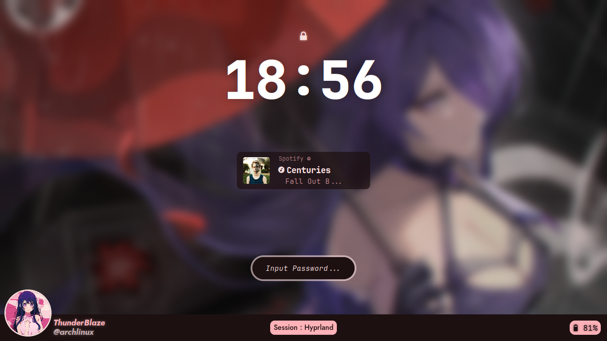
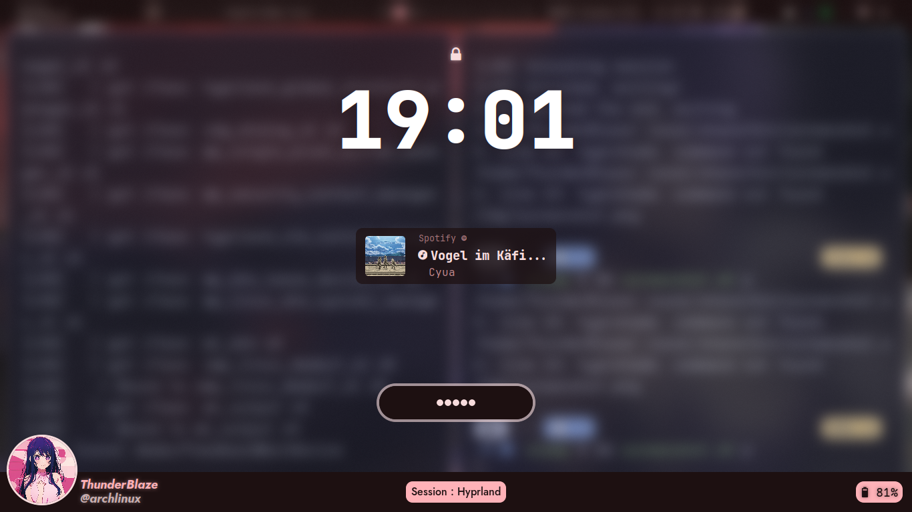
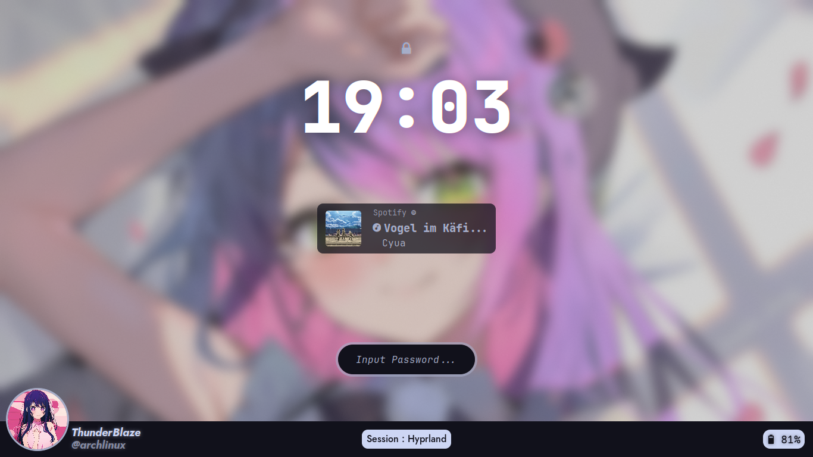
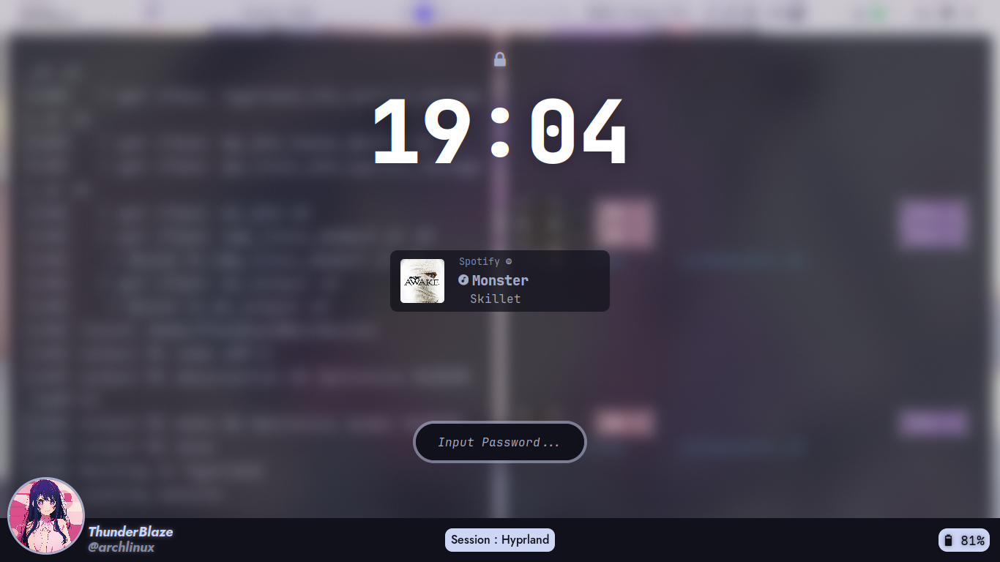
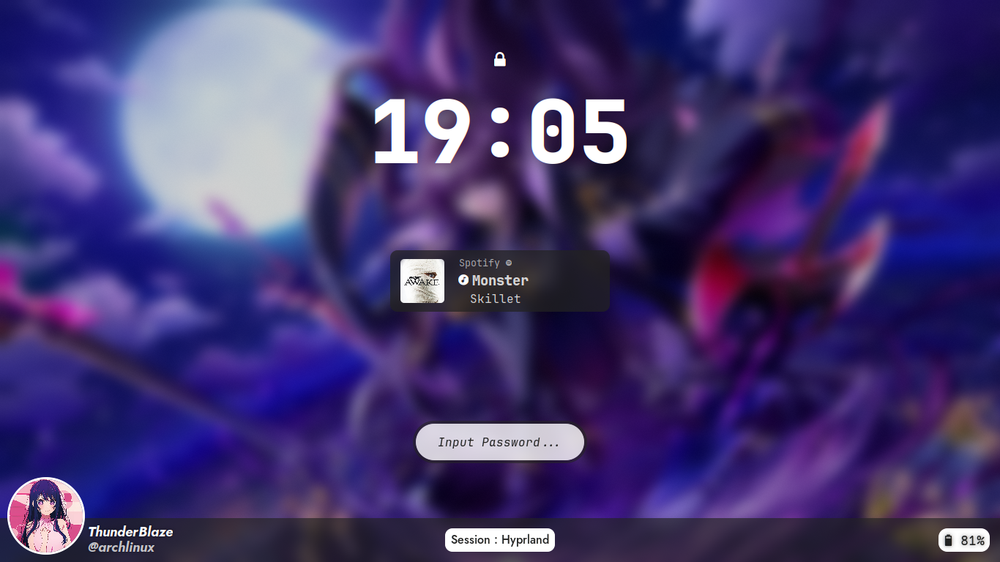
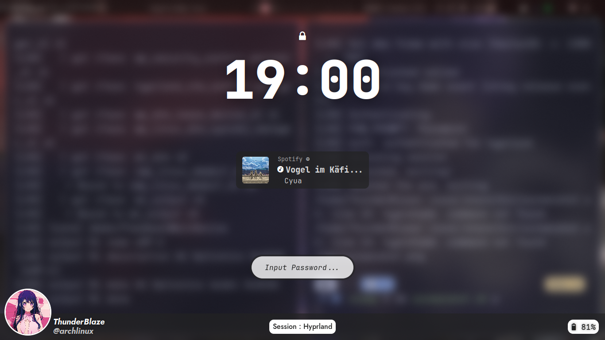

<div align = center>
    <a href="https://github.com/Thunder-Blaze/BlazinLock">

    </a>
</div>
<a id="introduction"></a>  
<div align="center">
A Modern HyprLock Theme which is compatible with End4dots, Hyprdots adn Default Hyprland Installations
</div>
<br>

### Easy to Use and Has the following Features
* Music Widget
* Time Widget
* PFP Widget along with Username and Hostname
* Battery Widget
* Modern Looking Input Box
* Auto Color Pallete generation for End4 and Hyprdots
* HyprLock Config Creation using Various Methords
  * Screenshot with End4 (Ags) Material Color Scheme
  * Current Wallpaper with End4 (Ags) Material Color Scheme
  * Screenshot with Hyprdots (Waybar) Color Scheme
  * Current Wallpaper with Hyprdots (Waybar) Color Scheme
  * Default Screenshot
  * Custom Image (Any Custom Image can be set as Hyprlock bg but it is not yet included in the Installer, you can run this manually)

<br>
<div align="center">
  <a href="#introduction"><kbd> <br> Introduction <br> </kbd></a>&ensp;&ensp;
  <a href="#installation"><kbd> <br> Installation <br> </kbd></a>&ensp;&ensp;
  <a href="#styles"><kbd> <br> Styles <br> </kbd></a>&ensp;&ensp;
</div>

<br>
<div align="center"></div>
<br>

<a id="installation"></a>  

---

> [!CAUTION]
> The script modifies your `hyprland` config to enable BlazinLock on Super + L Keybind.

To install, execute the following commands:

```shell
git clone https://github.com/Thunder-Blaze/BlazinLock/ ~/BlazinLock
cd ~/BlazinLock
./installer.sh
```

Please reboot or relogin after the install script completes.

> [!IMPORTANT]
> Please note that any hyprlock configurations you had will be overwritten.
> However, all replaced configs are backed up and may be recovered from `~/.config/hyde/hyprlock.conf.backup` and `~/.config/hyde/hyprlock.backup/`.

<a id="styles"></a>  

---

<table width="100%">
  <tr>
    <th><div align="center">blazinlock -ew</div></th>
    <th><div align="center">blazinlock -es</div></th>
  <tr>
  <tr>
    <td></td>
    <td></td>
  <tr>
  <tr>
    <th><div align="center">blazinlock -hw</div></th>
    <th><div align="center">blazinlock -hs</div></th>
  </tr>
  <tr>
    <td></td>
    <td></td>
  
  </tr>
  <tr>
    <th><div align="center">blazinlock -i "path"</div></th>
    <th><div align="center">blazinlock -s</div></th>
  </tr>
  <tr>
    <td></td>
    <td></td>
  </tr>
<table>


## CUSTOMIZING PFP
After Installation, goto "~/.config/hyde/hyprlock"
Replace the pfp.jpg with the image you want as your PFP

> [!IMPORTANT]
> The only File types that are currently supported are JPG, PNG and WEBP.